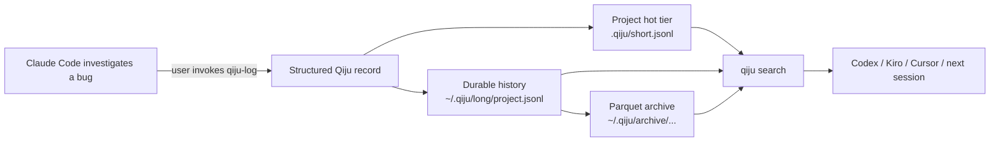

# Qiju · 起居

<p align="center">
  <strong>Your coding agent forgot. Qiju kept the record.</strong>
</p>

<p align="center">
  Local-first, structured session records that let Claude Code, Codex, Kiro,
  Cursor, and future agents continue from verifiable development history.
</p>

<p align="center">
  
  
  <a href="LICENSE"></a>
  
</p>

<p align="center">
  <a href="#quick-start">Quick Start</a> ·
  <a href="#how-it-works">How It Works</a> ·
  <a href="#supported-agents">Supported Agents</a> ·
  <a href="#architecture-at-a-glance">Architecture</a> ·
  <a href="README.zh.md">中文</a>
</p>

```bash
uv tool install qiju
cd /path/to/your/project
qiju init --host claude,codex
```

Inside Claude Code:

```text
/qiju-log Record the authentication decision, evidence, failed approaches, and next steps.
```

Later, inside Codex:

```text
$qiju-search authentication decision
```

Qiju does not silently record transcripts. You or your agent intentionally write a
structured record; Qiju stores that record in local files and makes it searchable
for the next session.

## One session ends. The record remains.



The important part is not that an AI gets "more memory." The important part is
that the decisions, evidence, failed paths, and next steps survive the session
that produced them.

| AI coding without Qiju | AI coding with Qiju |
| --- | --- |
| Context disappears with the thread or compaction. | Important work is written into durable local records. |
| The next agent gets a lossy summary. | The next agent can search and inspect the saved record. |
| Decisions and failed approaches are rediscovered. | Decisions, evidence, failed paths, and next steps can be preserved. |
| History is tied to one AI vendor. | Records are plain local files usable across supported agents. |
| Removing a tool may remove its state. | Qiju integrations can be removed while records remain. |

## What ships in Qiju

| Layer | Capability | Evidence |
| --- | --- | --- |
| Capture | Intentional structured session logging | `qiju temp-entry`, `qiju log` |
| Handoff | Portable skills for Claude Code, Codex, Kiro, and Cursor | `qiju init --host ...` |
| Retrieval | Project, time, source, agent, tag, keyword, regex, and session filters | `qiju search`, `qiju show` |
| Durability | Project hot tier plus durable user-level history | `.qiju/short.jsonl`, `~/.qiju/long/*.jsonl` |
| Archive | Local DuckDB/Parquet archive created by maintenance | `qiju maintain` |
| Safety | Write-time and retroactive best-effort redaction | `qiju redact`, `redaction_log.jsonl` |
| Lifecycle | Project registry and skill refresh after upgrade | `qiju update`, `~/.qiju/registry.d/` |
| Migration | Existing-store normalization and Kedu-to-Qiju copy migration | `qiju migrate` |
| Removal | Integration cleanup while preserving records by default | `qiju uninstall` |

## Quick Start

### Start a durable handoff in five minutes

1. Install Qiju:

   ```bash
   uv tool install qiju
   qiju --version
   ```

2. Connect the project to the hosts you plan to use:

   ```bash
   cd /path/to/your/project
   qiju init --host claude,codex
   ```

   Use `--host all` for Claude Code, Codex, Kiro, and Cursor. Use
   `qiju init --host codex --global` only when you want user-level host defaults.

3. Record what matters from inside the first agent:

   ```text
   /qiju-log Record the auth refresh decision, evidence, rejected approaches,
   and what the next agent should implement.
   ```

4. Continue from another supported host:

   ```text
   $qiju-search auth refresh decision
   ```

   Both agents read and write through the same Qiju record store. Qiju installs
   skills that tell the agent how to call the CLI; the CLI writes the records.

<details>
<summary>Install alternatives and source install</summary>

```bash
pipx install qiju          # if you use pipx
pip install qiju           # inside an active virtual environment
uvx qiju --help            # one-off run
```

The package-manager install covers normal use. Use the source installer when
working on Qiju itself or when installing the optional macOS launchd maintenance job:

```bash
git clone https://github.com/jasonshrepo/qiju.git
cd qiju
bash install.sh
bash install.sh --install-launchd   # optional macOS scheduled maintenance
```

Development setup:

```bash
uv sync
uv run pytest
```

</details>

## What a record looks like

Qiju stores structured handoff records, not raw chat transcripts. Shortened example:

```json
{
  "schema_version": 2,
  "id": "9b8b8df9-9d67-47de-b96d-91de7e5b7c4c:1",
  "project": "checkout-service",
  "agent": "claude",
  "source": "manual",
  "title": "Selected token refresh strategy",
  "tags": ["auth", "architecture"],
  "search_terms": ["refresh token", "401 retry", "session expiry"],
  "next_steps": ["implement bounded retry", "add expiry regression test"],
  "redactions": [],
  "body_md": "Decision, evidence, rejected alternatives, and handoff notes..."
}
```

The body is human-readable Markdown. The metadata makes the record filterable,
auditable, and useful to a later agent.

## How it works

### Local by design

| Tier | Location | Purpose |
| --- | --- | --- |
| Hot | `<project>/.qiju/short.jsonl` | Recent project context, kept near the repo |
| Durable | `~/.qiju/long/<project>.jsonl` | Complete retained record for that project |
| Archive | `~/.qiju/archive/project=<name>/month=<YYYY-MM>/entries.parquet` | Efficient long-term history after maintenance |

Records stay on the developer's machine. Qiju has no hosted service requirement,
does not send records to an embedding API, and does not require a vector database.
Project-local records can travel with the repository if the developer chooses to
commit them. External AI agents may still send content to their own providers;
Qiju does not change those providers' data-handling policies.

### Search first. Let the model reason second.

Qiju retrieval is deliberately two-phase:

1. `qiju search` applies explicit project, time, source, agent, tag, keyword,
   regex, or session filters.
2. Search returns candidate record IDs.
3. `qiju show '<uuid>:N'` hydrates the selected full record.
4. The agent decides which record is relevant and how to use it.

There are no embeddings, hidden similarity scores, or external embedding services.
The trade-off is honest: Qiju does not currently provide semantic similarity
search, so useful keywords, tags, or patterns matter.

## Architecture at a glance

Qiju anchors records to a deterministic project identity:

1. `QIJU_PROJECT_ROOT`
2. nearest `.qiju/config.json` marker
3. Git root
4. current directory fallback where safe

Project names are normalized into lowercase slugs so casing mistakes do not split
history. Reads merge the hot, durable, and archive tiers and deduplicate by record
ID.

For deeper details, see:

- [Architecture](docs/architecture.md)
- [CLI reference](docs/cli-reference.md)
- [Host integration](docs/host-integration.md)
- [Redaction and privacy](docs/redaction-and-privacy.md)

## Supported agents

Current support means Qiju installs portable Agent Skills. Qiju does not run,
schedule, or orchestrate the agent.

| Host | Project wiring | Skills | Invocation |
| --- | --- | --- | --- |
| Claude Code | Supported | `qiju-log`, `qiju-search`, `qiju-review` | `/qiju-log`, `/qiju-search`, `/qiju-review` |
| Codex | Supported | `qiju-log`, `qiju-search`, `qiju-review` | `$qiju-log`, `$qiju-search`, `$qiju-review` |
| Kiro | Supported | `qiju-log`, `qiju-search`, `qiju-review` | `/qiju-log`, `/qiju-search`, `/qiju-review` |
| Cursor | Supported | `qiju-log`, `qiju-search`, `qiju-review` | `/qiju-log`, `/qiju-search`, `/qiju-review` |

Natural-language requests such as "search Qiju for the auth decision" can also
trigger the installed skills in hosts that support skill discovery. Host interfaces
may change; Qiju keeps the record store host-independent.

## Built for a record that outlives one session

- **Maintain** - rotate the recent project tier, sweep stale staging files, and
  archive older durable records into Parquet.
- **Migrate** - normalize existing project names and copy legacy Kedu stores into
  Qiju without deleting the old store.
- **Redact** - remove known sensitive literals across JSONL and Parquet tiers, with
  an audit record.
- **Update** - refresh Qiju skill files across registered projects after a CLI
  upgrade.
- **Uninstall safely** - remove integration files while preserving records by
  default. `--purge-data` is a separate explicit path that requires confirmation.

## A record layer, not another memory layer

| Qiju is | Qiju is not |
| --- | --- |
| Intentional structured records | Automatic transcript capture |
| Deterministic retrieval | Vector similarity search |
| Local files the developer owns | Vendor-hosted memory |
| A handoff layer for existing agents | An agent framework |
| Evidence and next-step preservation | A replacement for Git |

Git records how the code changed. Qiju records the development context that
explains what was decided, what evidence was used, and what should happen next.
It records documented rationale and handoff notes, not hidden model reasoning.

Presentation and session-sharing tools can help humans review one session. Qiju
preserves structured local records so a later agent can search and continue the
work. The workflows are complementary.

## Why "Qiju"?

In imperial China, the 起居郎 recorded important words, actions, and decisions so
those who came later could examine what happened.

Qiju gives AI-assisted development the same kind of durable record:

> The agent does the work. Qiju keeps the record.

## Current status

Qiju v0.5.x is a developer preview.

Working and tested today:

- session record ingestion;
- deterministic search and exact retrieval;
- local hot and durable storage tiers;
- DuckDB/Parquet archival;
- project identity and registry;
- Claude Code, Codex, Kiro, and Cursor skill wiring;
- maintenance;
- migration;
- update;
- best-effort redaction;
- safe integration uninstall by default.

Known limits:

- intentional capture only;
- no automatic transcript ingestion;
- no semantic search;
- macOS and Linux only;
- CLI and record formats may still evolve.

## Documentation

- [Quick Start](#quick-start)
- [Architecture](docs/architecture.md)
- [Storage and retention](docs/architecture.md#storage-and-retention)
- [Record schema](docs/architecture.md#record-schema)
- [Retrieval](docs/architecture.md#retrieval)
- [Redaction and privacy](docs/redaction-and-privacy.md)
- [Agent host setup](docs/host-integration.md)
- [CLI reference](docs/cli-reference.md)
- [中文 README](README.zh.md)
- [Releases](CHANGELOG.md)

## Contributing

Qiju is small on purpose, but the handoff problem is large. Useful contributions
include broken host workflows, real handoff cases, Linux verification, docs
clarity, and tests for record durability.

Try Qiju on one real coding session. Switch agents, search the record, and tell
us where the handoff still breaks.

## License

Licensed under the [Apache License 2.0](LICENSE). Copyright 2026 Jason Shen.
