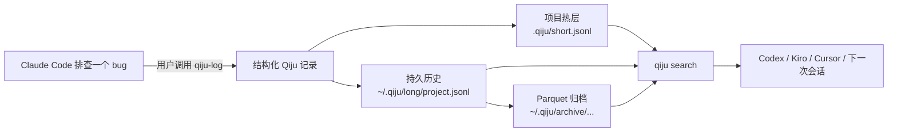

<div align="center">
  
</div>

# Qiju · 起居

<p align="center">
  <strong>你的编程 agent 忘了，Qiju 替它记着。</strong>
</p>

<p align="center">
  本地优先、结构化的会话记录，让 Claude Code、Codex、Kiro、Cursor 以及未来的
  agent 都能从可验证的开发历史中接着做下去。
</p>

<p align="center">
  <a href="https://pypi.org/project/qiju/"></a>
  
  
  <a href="LICENSE"></a>
  
</p>

<p align="center">
  <a href="#快速上手">快速上手</a> ·
  <a href="#工作原理">工作原理</a> ·
  <a href="#支持的-agent">支持的 agent</a> ·
  <a href="#方案架构一览">架构</a> ·
  <a href="README.md">English</a>
</p>

```bash
uv tool install qiju
cd /path/to/your/project
qiju init --host claude,codex
```

在 Claude Code 里：

```text
/qiju-log 记录这次的认证决策、证据、失败的尝试和下一步。
```

之后，在 Codex 里：

```text
$qiju-search 认证决策
```

Qiju 不会在后台静默记录对话。是你或你的 agent 有意地写下一条结构化记录；Qiju 把这条记录
保存在本地文件中，并让下一次会话能够检索到。

## 一次会话结束，记录留存。



重点不在于 AI 获得了“更多记忆”，而在于那些决策、证据、走过的弯路和下一步，能够在产生它们的
会话结束之后留存下来。

| 没有 Qiju 的 AI 编程 | 有 Qiju 的 AI 编程 |
| --- | --- |
| 上下文随线程或压缩一起消失。 | 重要的工作被写入持久的本地记录。 |
| 下一个 agent 只拿到有损的摘要。 | 下一个 agent 可以检索并查看保存下来的记录。 |
| 决策和失败的尝试被反复重新发现。 | 决策、证据、走过的弯路和下一步都能被保留。 |
| 历史被绑死在某一个 AI 厂商上。 | 记录是纯本地文件，可在受支持的 agent 间通用。 |
| 移除一个工具可能连同它的状态一起移除。 | 可以移除 Qiju 接入，而记录依然保留。 |

## Qiju 提供什么

| 层面 | 能力 | 证据 |
| --- | --- | --- |
| 捕获 | 有意的结构化会话记录 | `qiju temp-entry`、`qiju log` |
| 交接 | 面向 Claude Code、Codex、Kiro、Cursor 的可移植 skill | `qiju init --host ...` |
| 检索 | 按项目、时间、来源、agent、标签、关键词、正则和 session 过滤 | `qiju search`、`qiju show` |
| 持久 | 项目热层加用户级持久历史 | `.qiju/short.jsonl`、`~/.qiju/long/*.jsonl` |
| 归档 | 由维护流程创建的本地 DuckDB/Parquet 归档 | `qiju maintain` |
| 安全 | 写入时与事后的尽力而为脱敏 | `qiju redact`、`redaction_log.jsonl` |
| 生命周期 | 项目注册表与升级后的 skill 刷新 | `qiju update`、`~/.qiju/registry.d/` |
| 迁移 | 既有存储规范化与 Kedu→Qiju 复制迁移 | `qiju migrate` |
| 移除 | 清理接入，且默认保留记录 | `qiju uninstall` |

## 快速上手

### 五分钟开始一次持久交接

1. 安装 Qiju：

   ```bash
   uv tool install qiju
   qiju --version
   ```

2. 把项目接入你打算使用的 host：

   ```bash
   cd /path/to/your/project
   qiju init --host claude,codex
   ```

   用 `--host all` 接入 Claude Code、Codex、Kiro 和 Cursor。只有当你想设置用户级 host
   默认时，才用 `qiju init --host codex --global`。

3. 在第一个 agent 里记下重要内容：

   ```text
   /qiju-log 记录这次 token 刷新决策、证据、被否决的方案，以及下一个 agent 应当实现什么。
   ```

4. 从另一个受支持的 host 继续：

   ```text
   $qiju-search token 刷新决策
   ```

   两个 agent 都通过同一个 Qiju 记录存储读写。Qiju 安装的 skill 只告诉 agent 如何调用
   CLI；记录由 CLI 写入。

<details>
<summary>其他安装方式与源码安装</summary>

```bash
pipx install qiju          # 如果你使用 pipx
pip install qiju           # 在已激活的虚拟环境中
uvx qiju --help            # 一次性运行
```

包管理器安装能覆盖日常使用。只有在为 Qiju 本身开发，或安装可选的 macOS launchd 维护任务时，
才需要源码安装：

```bash
git clone https://github.com/jasonshrepo/qiju.git
cd qiju
bash install.sh
bash install.sh --install-launchd   # 可选的 macOS 定时维护
```

开发环境设置：

```bash
uv sync
uv run pytest
```

</details>

## 一条记录长什么样

Qiju 保存的是结构化的交接记录，而不是原始聊天记录。简化示例：

```json
{
  "schema_version": 2,
  "id": "9b8b8df9-9d67-47de-b96d-91de7e5b7c4c:1",
  "project": "checkout-service",
  "agent": "claude",
  "source": "manual",
  "title": "Selected token refresh strategy",
  "tags": ["auth", "architecture"],
  "search_terms": ["refresh token", "401 retry", "session expiry"],
  "next_steps": ["implement bounded retry", "add expiry regression test"],
  "redactions": [],
  "body_md": "Decision, evidence, rejected alternatives, and handoff notes..."
}
```

正文是人类可读的 Markdown。元数据让记录可过滤、可审计，并对之后的 agent 有用。

## 工作原理

### 本地优先的设计

| 层 | 位置 | 用途 |
| --- | --- | --- |
| 热层 | `<project>/.qiju/short.jsonl` | 近期项目上下文，保存在仓库旁 |
| 持久层 | `~/.qiju/long/<project>.jsonl` | 该项目完整保留的记录 |
| 归档 | `~/.qiju/archive/project=<name>/month=<YYYY-MM>/entries.parquet` | 维护之后高效的长期历史 |

记录留在开发者自己的机器上。Qiju 不要求任何托管服务，不把记录发送到 embedding API，也不需要
向量数据库。如果开发者愿意，项目内记录可以随仓库一起走。外部 AI agent 仍可能把内容发送给它们
自己的厂商；Qiju 不会改变那些厂商的数据处理策略。

### 先检索，再让模型推理

Qiju 的检索刻意分两阶段：

1. `qiju search` 应用明确的项目、时间、来源、agent、标签、关键词、正则或 session 过滤。
2. search 返回候选记录的 id。
3. `qiju show '<uuid>:N'` 水合选中的完整记录。
4. 由 agent 决定哪条记录相关、如何使用。

没有 embedding，没有隐藏的相似度打分，也没有外部 embedding 服务。这个取舍是诚实的：Qiju
目前不提供语义相似度搜索，因此有用的关键词、标签或模式很重要。

## 方案架构一览

Qiju 把记录锚定到确定性的项目身份：

1. `QIJU_PROJECT_ROOT`
2. 最近的 `.qiju/config.json` 标记
3. Git 根
4. 安全时回退到当前目录

项目名被规范化为小写 slug，因此大小写笔误不会分裂历史。读取时合并热层、持久层和归档层，并按
记录 id 去重。

更深入的细节见：

- [架构](docs/architecture.md)
- [CLI 参考](docs/cli-reference.md)
- [Host 接入](docs/host-integration.md)
- [脱敏与隐私](docs/redaction-and-privacy.md)

## 支持的 agent

当前支持意味着 Qiju 会安装可移植的 Agent Skills。Qiju 不运行、不调度、也不编排 agent。

| Host | 项目接入 | Skill | 调用方式 |
| --- | --- | --- | --- |
| Claude Code | 支持 | `qiju-log`、`qiju-search`、`qiju-review` | `/qiju-log`、`/qiju-search`、`/qiju-review` |
| Codex | 支持 | `qiju-log`、`qiju-search`、`qiju-review` | `$qiju-log`、`$qiju-search`、`$qiju-review` |
| Kiro | 支持 | `qiju-log`、`qiju-search`、`qiju-review` | `/qiju-log`、`/qiju-search`、`/qiju-review` |
| Cursor | 支持 | `qiju-log`、`qiju-search`、`qiju-review` | `/qiju-log`、`/qiju-search`、`/qiju-review` |

诸如“在 Qiju 里搜认证决策”这样的自然语言请求，在支持 skill 发现的 host 中也能触发已安装的
skill。Host 接口可能变化；Qiju 让记录存储保持与 host 无关。

## 为比单次会话更长久的记录而生

- **维护（Maintain）**——滚动近期项目层，清扫过期的暂存文件，并把较旧的持久记录归档为
  Parquet。
- **迁移（Migrate）**——规范化既有项目名，并把旧的 Kedu 存储复制进 Qiju，且不删除旧存储。
- **脱敏（Redact）**——跨 JSONL 和 Parquet 各层移除已知的敏感字面值，并留下审计记录。
- **更新（Update）**——CLI 升级后，刷新所有已注册项目中的 Qiju skill 文件。
- **安全卸载（Uninstall safely）**——移除接入文件，且默认保留记录。`--purge-data` 是单独的
  显式路径，需要确认。

## 记录层，而非又一个记忆层

| Qiju 是 | Qiju 不是 |
| --- | --- |
| 有意的结构化记录 | 自动的对话抓取 |
| 确定性检索 | 向量相似度搜索 |
| 开发者自有的本地文件 | 厂商托管的记忆 |
| 面向既有 agent 的交接层 | Agent 框架 |
| 证据与下一步的保存 | Git 的替代品 |

Git 记录代码如何变化。Qiju 记录解释“为什么这样决定、用了什么证据、下一步该做什么”的开发
上下文。它记录的是有据可查的理由和交接笔记，而非隐藏的模型推理。

展示与会话分享工具可以帮人类审阅某一次会话。Qiju 保存结构化的本地记录，让之后的 agent 能
检索并继续工作。两者的工作流是互补的。

## 为什么叫 “Qiju”？

在中国古代，**起居郎**记录重要的言论、行动与决策，好让后来的人能查考究竟发生了什么。

Qiju 为 AI 辅助开发提供同样的持久记录：

> The agent does the work. Qiju keeps the record.（agent 负责做事，Qiju 负责留下记录。）

## 当前状态

Qiju v0.5.x 是开发者预览版。

今天已经可用并经过测试：

- 会话记录摄取；
- 确定性搜索与精确检索；
- 本地热层与持久存储层；
- DuckDB/Parquet 归档；
- 项目身份与注册表；
- Claude Code、Codex、Kiro、Cursor 的 skill 接入；
- 维护；
- 迁移；
- 更新；
- 尽力而为的脱敏；
- 默认安全的接入卸载。

已知限制：

- 仅有意捕获；
- 没有自动对话摄取；
- 没有语义搜索；
- 仅支持 macOS 和 Linux；
- CLI 与记录格式仍可能演变。

## 文档

- [快速上手](#快速上手)
- [架构](docs/architecture.md)
- [存储与保留](docs/architecture.md#storage-and-retention)
- [记录 schema](docs/architecture.md#record-schema)
- [检索](docs/architecture.md#retrieval)
- [脱敏与隐私](docs/redaction-and-privacy.md)
- [Agent host 设置](docs/host-integration.md)
- [CLI 参考](docs/cli-reference.md)
- [English README](README.md)
- [版本发布](CHANGELOG.md)

## 参与贡献

Qiju 刻意做得很小，但交接问题很大。有价值的贡献包括：失效的 host 工作流、真实的交接案例、
Linux 验证、文档清晰度，以及记录持久性的测试。

在一次真实的编程会话里试试 Qiju。切换 agent，检索记录，然后告诉我们交接还在哪里断掉。

## 许可证

基于 [Apache License 2.0](LICENSE) 授权。Copyright 2026 Jason Shen。
